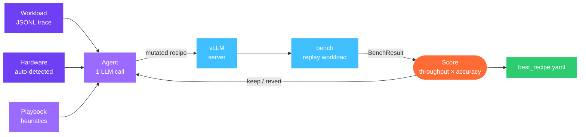
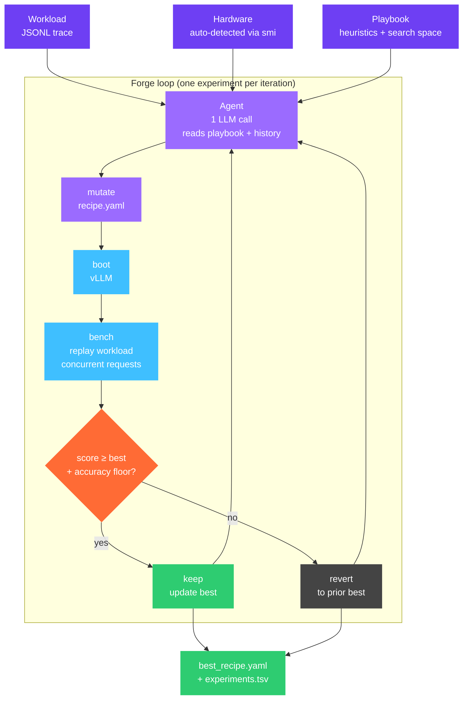

# aevyra-forge

[](https://github.com/aevyraai/forge/actions/workflows/ci.yml)
[](https://github.com/aevyraai/forge/actions/workflows/security.yml)
[](LICENSE)
[](https://aevyra.mintlify.app/forge/)

Forge tunes your vLLM deployment overnight. Give it a model, a GPU, and a
workload trace. It runs an autonomous loop — propose a config, boot the
server, benchmark against your real workload, keep or revert, repeat. By
morning you have a deployment recipe that beats hand-tuned defaults, with a
full audit trail of every experiment.

```
Witness  →  captures what happened           (aevyra-witness)
Verdict  →  judges it                        (aevyra-verdict)
Origin   →  finds where it went wrong        (aevyra-origin)
Reflex   →  fixes the prompts                (aevyra-reflex)
Forge    →  tunes the deployment             (you are here)
```



## Use cases

- **Maximising throughput overnight** — run Forge against your production
  workload before a traffic spike. Wake up to a recipe that gets 30–50% more
  tokens per second without touching the model weights.
- **Reducing P99 latency** — Forge searches chunked prefill, prefix caching,
  and batching knobs jointly. The playbook encodes which combinations help and
  which hurt on your GPU class.
- **Validating a new GPU** — spin up a T4, A100, or MI300X and get a
  hardware-specific best config in one command. Forge auto-detects the GPU via
  `nvidia-smi` / `rocm-smi` — no lookup tables, no manual spec sheets.
- **Audit-ready deployment** — every experiment is checkpointed to disk with
  its config, bench result, and agent rationale. The full search history is
  queryable and exportable as TSV or JSON.

Works with any LLM for the agent — Claude, OpenAI, OpenRouter, local Ollama or
vLLM, or any OpenAI-compatible endpoint.

## Install

```bash
pip install aevyra-forge               # Claude included by default
pip install aevyra-forge[openai]       # add OpenAI / OpenRouter / Together / Groq
pip install aevyra-forge[all]          # everything
```

Python 3.10+. vLLM must be installed separately on the GPU host:

```bash
pip install vllm                       # NVIDIA
pip install vllm --extra-index-url ... # AMD ROCm — follow vLLM's ROCm guide
```

| Provider | Extra | Env var |
|---|---|---|
| **Anthropic** | _(included)_ | `ANTHROPIC_API_KEY` |
| **OpenAI** | `[openai]` | `OPENAI_API_KEY` |
| **OpenRouter** | `[openai]` | `OPENROUTER_API_KEY` |
| **Together AI** | `[openai]` | `TOGETHER_API_KEY` |
| **Groq** | `[openai]` | `GROQ_API_KEY` |
| **Ollama** | `[openai]` | — |

## Quick start

```bash
pip install aevyra-forge
export ANTHROPIC_API_KEY=sk-ant-...

aevyra-forge tune \
  --model meta-llama/Llama-3.2-1B-Instruct \
  --device cuda \
  --workload examples/sample_workload.jsonl \
  --max-experiments 10
```

Forge auto-detects your GPU, boots vLLM with the baseline config, then runs
the loop. Each experiment takes 5–15 minutes. Results are saved to `.forge/`.

Resume an interrupted run — all config is read from disk, no args needed:

```bash
aevyra-forge tune resume
```

View results:

```bash
aevyra-forge report .forge/
```

```
=== Forge Report: .forge/runs/001_2026-05-13T04-10-00 ===

Total experiments: 12
Best score:        1.2847
Best recipe ID:    e5f6a7b8
Best generation:   4
Throughput:        3421.0 tok/s
P99 latency:       187 ms

exp  id        gen  score   throughput  p99_ms  accuracy  kept  rationale
0    a1b2c3d4  0    1.0000  2718.3      241     0.991     ✓     baseline
1    e5f6a7b8  1    1.1204  3047.1      218     0.993     ✓     enable_prefix_caching: prefix_cache_hit...
2    f9a0b1c2  2    0.9831  2601.5      289     0.989     ✗     reduce max_num_seqs to 64 to lower p99...
...
```

## How it works



**One artifact** — `recipe.yaml` — holds the complete vLLM config across three
tuning layers: serving args (v0), quantization (v0.2), and kernel overrides
(v0.3). Every mutation is one targeted change; the agent's rationale explains
why.

**One verifier** — `bench.py` — replays the workload against the running vLLM
server at full concurrency, returning structured throughput, P50/P99 latency,
TTFT, and accuracy.

**One playbook** — `playbook.md` — encodes serving expertise as heuristics the
agent reads. It tells the agent what to try first, what ranges are safe, and
which combinations to avoid. Custom playbooks can be passed with `--playbook`.

**One tight loop** — ~5–15 min per experiment. The agent picks one mutation per
call, keeping the search space focused and the audit trail reviewable.

## Workload format

A workload is a JSONL file, one request per line:

```jsonl
{"prompt": "Explain attention in transformers.", "expected_output_tokens": 256}
{"prompt": "Write a Python function to merge two sorted lists.", "expected_output_tokens": 128}
{"prompt": "What is the capital of France?", "expected_output_tokens": 32, "arrival_offset_s": 0.5}
```

`arrival_offset_s` is optional (defaults to 0). `expected_output_tokens` tells
the bench verifier how long each response should be.

A 50-example starter is bundled:

```bash
aevyra-forge tune \
  --model meta-llama/Llama-3.2-1B-Instruct \
  --device cuda \
  --workload examples/sample_workload.jsonl
```

For production use, export a sample of your real traffic from Langfuse, your
API gateway, or any JSONL source. Forge optimizes against your actual
distribution, not a benchmark.

## CLI reference

```bash
aevyra-forge tune [OPTIONS]          # start a new tuning run
aevyra-forge tune resume             # resume the latest interrupted run
aevyra-forge report <run-dir>        # print a summary table
aevyra-forge playbook show           # print the active playbook
aevyra-forge playbook validate       # validate playbook structure
```

Key options for `tune`:

| Option | Default | Description |
|---|---|---|
| `--model` | required | HuggingFace model ID or local path |
| `--device` | `cuda` | GPU backend: `cuda`, `rocm`, or `cpu` |
| `--workload` | required | Path to workload JSONL |
| `--concurrency` | `8` | Max concurrent requests during benchmarking |
| `--llm` | `anthropic/claude-sonnet-4-6` | Agent LLM (`provider/model`) |
| `--max-experiments` | `50` | Experiment budget |
| `--max-hours` | `12.0` | Wall-clock budget |
| `--max-dollars` | — | LLM spend cap in USD |
| `--accuracy-floor` | `0.99` | Minimum acceptable accuracy |
| `--playbook` | _(bundled)_ | Path to custom playbook |
| `--dry-run` | `False` | Skip vLLM; use synthetic bench results |
| `--verbose` | `False` | Debug logging |

The `--llm` flag follows the same `provider/model` convention as aevyra-reflex:
`openrouter/meta-llama/llama-3.1-70b`, `openai/gpt-4o`, `ollama/qwen3:8b`.

## Run persistence and resume

Every run is checkpointed under `.forge/runs/<id>_<timestamp>/`:

```
.forge/
  runs/
    001_2026-05-13T04-10-00/
      config.json          ← model, hardware, workload, all CLI flags
      experiments.jsonl    ← append-only log (one line per experiment)
      experiments.tsv      ← human-readable table
      experiments.json     ← structured table for tooling
      best_recipe.yaml     ← best config so far (updated each experiment)
      completed.json       ← written on clean finish; absent = interrupted
```

A run with `experiments.jsonl` but no `completed.json` was interrupted and
can be resumed. `aevyra-forge tune resume` finds the latest such run and
continues from where it stopped — no args needed because everything is in
`config.json`.

```bash
aevyra-forge tune resume             # resume latest interrupted run
```

## Tuning layers

| Layer | What it tunes | v0 status |
|---|---|---|
| **1. Config** | vLLM serving args: batching, caching, parallelism | ✅ Functional |
| **2. Quantization** | INT4/FP8/INT8, KV cache precision | Scaffolded (v0.2) |
| **3. Kernel synthesis** | Custom kernels via AutoKernel hook | Scaffolded (v0.3) |

Layer 1 has the highest leverage per experiment because it requires no
recompilation. Forge escalates to Layer 2 when Layer 1 converges.

## Development

```bash
git clone https://github.com/aevyraai/forge
cd forge
pip install -e ".[dev]"

pytest tests/ -v         # 79 unit tests, no GPU needed
ruff check .
ruff format --check .
```

Tests cover `workload`, `recipe`, `result`, `playbook`, and `cli` helpers
(including mocked `nvidia-smi` / `rocm-smi` paths). GPU-dependent paths —
`bench`, `orchestrator`, `runner` — are tested in Colab.

## Contributing

Read [AGENT.md](./AGENT.md) before opening a PR.
Check [CONTRIBUTING.md](./CONTRIBUTING.md) for ground rules.

## License

Apache 2.0.
