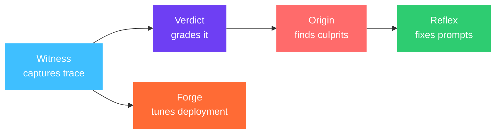
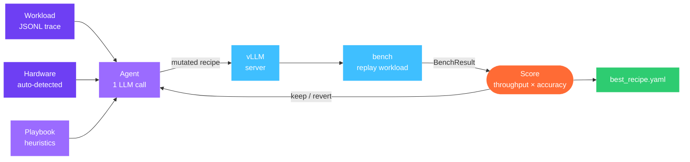

aevyra-forge tunes your vLLM deployment overnight. Give it a model, a GPU,
and a workload trace. It runs an autonomous loop — propose a config, boot the
server, benchmark against your real workload, keep or revert, repeat. By
morning you have a deployment recipe that beats hand-tuned defaults, with a
full audit trail of every experiment.

```bash
pip install aevyra-forge
```

vLLM exposes roughly 40 serving args. The defaults are conservative — designed
to work safely on any GPU, not to max out any specific one. On a T4 with a
chat workload the defaults leave significant throughput on the table:

```
Baseline (defaults):    2718 tok/s   P99: 241 ms
After Forge (8 exps):   3421 tok/s   P99: 187 ms   (+26%)
```

Forge finds that gain by searching the joint space of batching, caching, and
memory knobs — and keeping only the changes that improve the score on your
actual workload.

## Where Forge fits



Forge operates on the infrastructure layer. Where Reflex rewrites prompts and
Origin diagnoses agent failures, Forge maximises throughput and minimises
latency for a model that's already doing the right thing.

## The loop



Each iteration: the agent reads the playbook and experiment history, proposes
one targeted change, and Forge measures whether it actually helps. The audit
trail captures every decision — config, result, rationale — so you can see
exactly how the winning recipe was found.

## Tuning layers

| Layer | What it tunes | Status |
|---|---|---|
| **1. Config** | vLLM serving args: batching, caching, parallelism | ✅ v0.1 |
| **2. Quantization** | INT4/FP8/INT8, KV cache precision | 🔧 v0.2 |
| **3. Kernel synthesis** | Custom kernels via AutoKernel | 🚧 v0.3 |

Layer 1 has the highest leverage per experiment because it requires no
recompilation. Forge escalates to Layer 2 when Layer 1 converges.

## Works with any GPU and LLM

Auto-detects NVIDIA and AMD GPUs via `nvidia-smi` / `rocm-smi`. Works with
any OpenAI-compatible LLM for the agent.

```bash
pip install aevyra-forge               # Claude included by default
pip install aevyra-forge[openai]       # add OpenAI / OpenRouter / Together / Groq
```

| Provider | Env var |
|---|---|
| **Anthropic** | `ANTHROPIC_API_KEY` |
| **OpenAI** | `OPENAI_API_KEY` |
| **OpenRouter** | `OPENROUTER_API_KEY` |
| **Ollama** | — |

Python 3.10+. Apache-2.0 licensed.

<CardGroup cols={2}>
  <Card title="Quick start" icon="bolt" href="/forge/quickstart">
    Run your first tuning session in 15 minutes
  </Card>
  <Card title="Tutorial" icon="book-open" href="/forge/tutorial-colab-quickstart">
    Dry-run walkthrough with real log output
  </Card>
  <Card title="Concepts: Recipe" icon="file-code" href="/forge/concepts/recipe">
    The artifact Forge proposes, mutates, and keeps or reverts
  </Card>
  <Card title="Concepts: Playbook" icon="book" href="/forge/concepts/playbook">
    The agent's instruction manual
  </Card>
</CardGroup>
