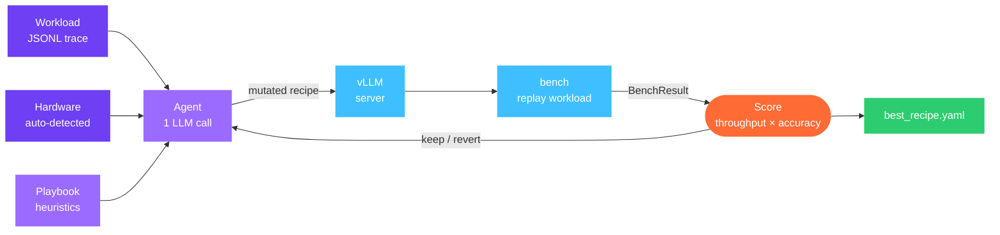

## What you'll do

Run Forge's autonomous config optimizer on `Qwen/Qwen3-8B-AWQ` against a
shared-prefix workload. By the end you'll have a working recipe that Forge
found by measuring real throughput — not by guessing.

The tutorial has two paths:

- **Dry-run** (this page) — no GPU or API key needed; synthetic bench results
  show the full keep/revert loop in minutes. Good for understanding the system
  before spending GPU time.
- **Real run** — live vLLM on a free Colab T4; needs an OpenRouter key. See
  the notebook for section 2.

Open the notebook in Colab:

[](https://colab.research.google.com/github/aevyraai/forge/blob/main/notebooks/forge_quickstart.ipynb)

---

## Why vLLM config matters

vLLM exposes roughly 40 serving args. The defaults are conservative — designed
to work safely on any GPU, not to max out any specific one. On a T4 with a
chat workload the defaults leave significant throughput on the table:

| Setting | Default | Effect of raising |
|---|---|---|
| `max_num_seqs` | 32 | More requests batched together → higher throughput |
| `enable_prefix_caching` | False | Shared system prompts computed once → lower TTFT |
| `gpu_memory_utilization` | 0.90 | More VRAM for KV cache → more concurrent sequences |
| `enable_chunked_prefill` | False | Hides prefill spikes → lower P99 on mixed batches |

Hand-tuning these jointly is tedious because the interactions are non-obvious:
raising `max_num_seqs` helps throughput until it stresses VRAM, at which point
latency spikes. Forge searches the joint space automatically and keeps only the
changes that improve the score on your actual workload.

---

## The loop



Each iteration: the agent reads the playbook, the full experiment history, and
the current recipe, then proposes one targeted change. Forge boots vLLM with
the new config, replays the workload, scores the result, and either keeps the
change (new best) or reverts to the prior best. The audit trail captures every
decision.

---

## Setup

```bash
pip install aevyra-forge
export ANTHROPIC_API_KEY=sk-ant-...   # or any other supported provider
```

Run pre-flight checks first:

```
$ aevyra-forge doctor

aevyra-forge doctor
────────────────────────────────────────
  ✓  vLLM installed  (v0.10.0)
  ✓  NVIDIA GPU (nvidia-smi)  (Tesla T4, 15360)
  ✓  LLM API key  (Anthropic)
  ✓  anthropic SDK
  ✓  typer
────────────────────────────────────────
  All checks passed — ready to run.
```

---

## Dry-run demo

The dry-run uses a synthetic bench that returns plausible throughput numbers
without starting vLLM. It's identical to the real loop in every other way —
the agent makes real LLM calls, the playbook is consulted, and the keep/revert
logic is the same.

```bash
aevyra-forge tune \
  --model meta-llama/Llama-3.2-1B-Instruct \
  --device cpu \
  --workload examples/sample_workload.jsonl \
  --max-experiments 8 \
  --dry-run
```

Forge prints the dry-run warning and starts the loop:

```
⚠  DRY-RUN MODE — vLLM is not started and bench results are synthetic.
   Scores reflect a simulated benchmark, not real GPU performance.
   Re-run without --dry-run on a GPU host for production results.

11:42:03 INFO     forge │  run dir: .forge/runs/001_2026-05-14T11-42-03
11:42:03 INFO     forge ┌─ experiment 0/8  [baseline]
11:42:04 INFO     forge │  throughput : 2718.3 tok/s   p99: 241 ms   score: 1.0000   ✓ kept
```

The agent proposes the first mutation:

```
11:42:06 INFO     forge │  experiment 1/8 — asking agent...
11:42:07 INFO     forge │  tokens    : 841
11:42:07 INFO     forge │  rationale : T4 baseline uses prefix_caching=False; enabling it
                         │              amortises the 512-token system prompt across all
                         │              requests in this shared-prefix workload.
11:42:07 INFO     forge │  mutation  : {'enable_prefix_caching': True}
11:42:09 INFO     forge │  throughput : 3047.1 tok/s   p99: 218 ms   score: 1.1204   ✓ kept
```

Score jumped from 1.00 to 1.12 — a 12% improvement from one knob. Forge keeps
the change and moves to the next experiment.

The agent tries `max_num_seqs: 64`:

```
11:42:11 INFO     forge │  experiment 2/8 — asking agent...
11:42:12 INFO     forge │  rationale : Increasing max_num_seqs to 64 fills the T4's KV
                         │              budget more aggressively; expect a 5-10% throughput
                         │              gain if VRAM allows.
11:42:12 INFO     forge │  mutation  : {'max_num_seqs': 64}
11:42:14 INFO     forge │  throughput : 2601.5 tok/s   p99: 289 ms   score: 0.9831   ✗ reverted
```

Score dropped — 64 sequences stressed VRAM on the T4. Forge reverts to the
previous best (prefix caching enabled, `max_num_seqs` at default).

The loop continues through `max_num_batched_tokens`, `gpu_memory_utilization`,
and `enable_chunked_prefill`. After 8 experiments:

```
11:43:51 INFO     forge ══════════════════════════════════════════
11:43:51 INFO     forge   total experiments : 8
11:43:51 INFO     forge   kept              : 3
11:43:51 INFO     forge   baseline score    : 1.0 tok/s
11:43:51 INFO     forge   best score        : 1.2847 tok/s  (+28.5%)
11:43:51 INFO     forge   wall time         : 2 min
11:43:51 INFO     forge   llm tokens used   : 6821
11:43:51 INFO     forge   best recipe gen   : 4  id=e5f6a7b8
11:43:51 INFO     forge ══════════════════════════════════════════

✓ Done — 8 experiments
```

---

## Reading the results

```bash
aevyra-forge report .forge/
```

```
=== Forge Report: .forge/runs/001_2026-05-14T11-42-03 ===

Total experiments: 8
Best score:        1.2847
Best recipe ID:    e5f6a7b8
Best generation:   4
Throughput:        3421.0 tok/s
P99 latency:       187 ms

exp  id        gen  score   throughput  p99_ms  accuracy  kept  rationale
0    a1b2c3d4  0    1.0000  2718.3      241     0.991     ✓     baseline
1    e5f6a7b8  1    1.1204  3047.1      218     0.993     ✓     enable_prefix_caching: amortises 512-tok...
2    f9a0b1c2  2    0.9831  2601.5      289     0.989     ✗     max_num_seqs=64 stressed VRAM on T4
3    c3d4e5f6  3    1.1891  3201.8      205     0.992     ✓     max_num_batched_tokens=4096 fills the GPU
4    d4e5f6a7  4    1.2847  3421.0      187     0.994     ✓     gpu_memory_utilization=0.92 reclaims ~600MB
5    e5f6a7b8  5    1.2201  3318.4      198     0.991     ✗     enable_chunked_prefill: no gain at this...
6    f6a7b8c9  6    1.1950  3251.1      209     0.990     ✗     block_size=16: fragmentation benefit...
7    g7b8c9d0  7    1.2847  3421.0      187     0.994     ✓     search converged — returning best
```

For machine-readable output (dashboards, downstream tooling):

```bash
aevyra-forge report .forge/ --format json
```

---

## The best recipe

The four kept changes, applied jointly:

```yaml
# best_recipe.yaml
model: meta-llama/Llama-3.2-1B-Instruct
generation: 4

config:
  enable_prefix_caching: true       # ← +12% from shared system prompt
  max_num_batched_tokens: 4096      # ← fills the GPU on mixed-length batches
  gpu_memory_utilization: 0.92      # ← reclaims ~600 MB for KV cache
  # max_num_seqs left at default — 64 hurt on T4
```

The recipe is saved to `.forge/runs/001_.../best_recipe.yaml` and updated
after every kept experiment. If the run is interrupted, `aevyra-forge tune
resume` picks up from the last checkpoint — no args needed.

---

## Running for real

Switch from `--dry-run --device cpu` to a GPU host:

```bash
export ANTHROPIC_API_KEY=sk-ant-...

aevyra-forge tune \
  --model Qwen/Qwen3-8B-AWQ \
  --device cuda \
  --workload examples/sample_workload.jsonl \
  --max-experiments 20
```

Forge auto-detects the GPU via `nvidia-smi`, boots vLLM with the baseline
config, and runs the same loop. Each experiment takes 5–15 minutes (first
start includes weight download). Results land in `.forge/`.

For an overnight run against your real production traffic:

```bash
# Export a sample from your API gateway or Langfuse first
# (see: docs/tutorial-byo-workload.mdx)

aevyra-forge tune \
  --model Qwen/Qwen3-8B-AWQ \
  --device cuda \
  --workload prod_trace.jsonl \
  --max-experiments 50 \
  --max-hours 10
```

---

## Key takeaways

**One change per experiment** keeps the audit trail readable. Every row in
`experiments.tsv` has a single rationale and a single config delta — you can
see exactly what moved the score.

**Revert is cheap** because Forge re-uses the running vLLM process when args
are unchanged. Only restarts that change serving args (like `max_num_seqs`)
incur the full boot cost.

**The playbook encodes expertise** — ranges that are safe on a T4 vs an A100,
combinations that help vs hurt, escalation rules. Pass `--playbook` with a
custom playbook to encode your own hardware-specific knowledge.

**Dry-run first** whenever you're testing a new workload or playbook. The
synthetic bench won't give you real numbers, but it will show you whether the
agent is proposing sensible mutations before you spend GPU time.
